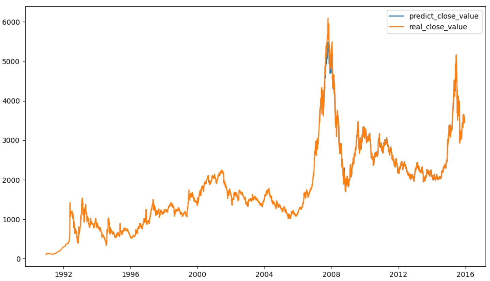
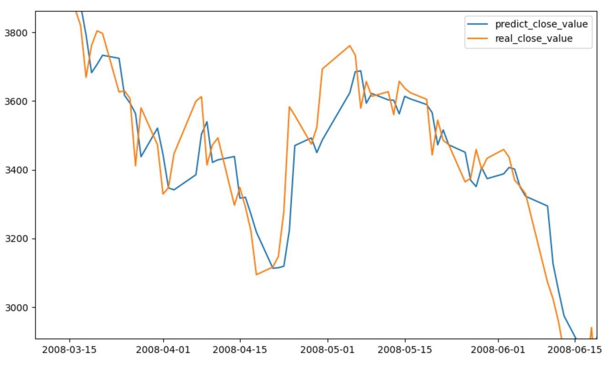
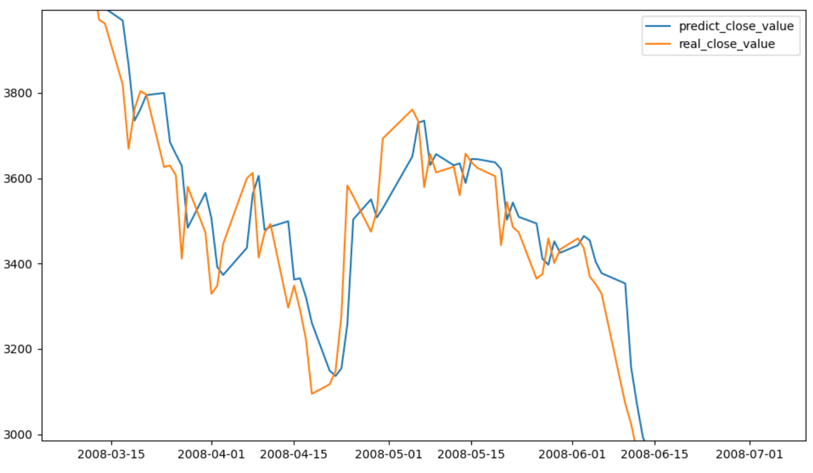

# 基于GRU的上证指数预测
## 模型
简单的GRU Network
## 实验数据
* 1992年-2016年上证指数的 **收盘价** 和 **交易量** 作为特征数据。一共6000+天数。
* 数据格式为CSV，具体样式参考 ./data/shock_data.csv文件。数据下载地址为
## 实验设定
### 用前4000天作为训练数据（称为过去值）进行训练，预测后2000+天的 **收盘价**（称为未来值）。  
### 一共有两种预测方式：
* **预测方式1**：用真实的未来值，逐日预测，相当于每日都有真实值加入input data。这种方式可以理解为会每日更新股价的预测方式。
* **预测方式2**：没有真实未来值，逐日预测，并将其更新到input data，进行下一天的预测。这种方式可以理解为直接预测未来一段时间的股价变化的方式。

## 实验结果
### 预测方式1
#### A, epoch=10，batchsize=12，时间步长=30天，输入特征=[收盘价，交易量]
* 结果如下图所示
采用预测方式1，从2007年开始的蓝色线为预测值 ，黄色线为真实值。两次牛市（2008和2015年）的预测精度较低，可能因为黑天鹅事件所致。其余部分基本拟合，说明在稳定市场的条件下，这个方法有一定效果。
#### B, epoch=10，batchsize=12，时间步长=30天，输入特征=[收盘价]
* 结果如下图所示  
拟合度很好
#### 细节对比，放大到某一段时间
* A方案
使用2个特征，可以减少误差，比如上图中的转折点位置，黄线蓝线的垂直距离相比B方案减少了一点。
* B方案
可以看到预测是有一定滞后性的，输入一个转折日的值之后，才会有变化。方法一的方式，主要是看能不能预测出转折点（比黄线早出现的篮线）。
